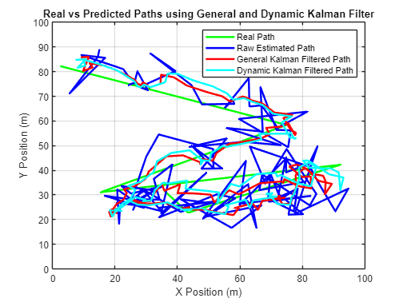
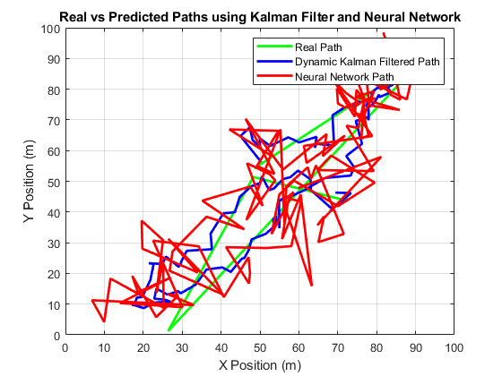

# Adaptive Machine Learning for Dynamic Radiolocation

Estimating a device's position from noisy WiFi signal strength (RSS) with a non-parametric machine learning model, then tracking a moving target with an adaptive Kalman filter. Built in MATLAB as a directed research project at the University of Victoria.

## How it works

1. **Simulated environment:** a 100 m × 100 m area with four base stations. RSS measurements follow a log-distance path-loss model with Gaussian noise, giving training, validation, and evaluation sets of 8,000 / 1,000 / 10,000 samples.
2. **Parzen window estimator:** a Gaussian-kernel density estimator maps an RSS vector to a location. The kernel width is tuned with leave-one-out cross-validation.
3. **Kalman filter tracking:** the estimator's position fixes feed a constant-velocity Kalman filter. The adaptive ("dynamic") variant recomputes the measurement-noise covariance at every step from the kernel weights instead of using a fixed value.
4. **Tuning and benchmarking:** the process-noise covariance is optimized with `fmincon`, and the full pipeline is compared against a feedforward neural network.

## Results

| Method | Tracking MSE (m²) |
| --- | --- |
| Raw Parzen window estimates | ~110.5 |
| Kalman filter (fixed noise covariance) | ~49.1 |
| Adaptive Kalman filter | ~37.5 |

On a separate head-to-head trajectory, the adaptive Kalman filter (MSE ≈ 51) tracked the true path far more closely than the neural network baseline (MSE ≈ 115).

## Repository layout

| Path | Contents |
| --- | --- |
| `interim/` | Interim report: Parzen window vs. neural network localization, with comparative testing across noise levels and sample sizes |
| `final/` | Final report: Kalman filter tracking, process-noise optimization, and the neural network comparison |
| `*.mlx` | Original MATLAB live scripts (with outputs and figures) |
| `*.m` | Plain-text exports of the live script code, readable on GitHub |
| `Adaptive_ML_Radiolocation_Report.pdf` | Combined technical report: the interim write-up plus the final work, with code and outputs |

## Running it

Open either `.mlx` file in MATLAB with `gaussian_kernel.m` (and `simulate_kalman.m` for the final report) in the same folder, then run all sections. The neural network comparison uses the Deep Learning Toolbox, and the covariance tuning uses the Optimization Toolbox.

## Author

**Benjamin Philipenko** · [benphilipenko.ca](https://benphilipenko.ca/adaptive-ml-radiolocation)
